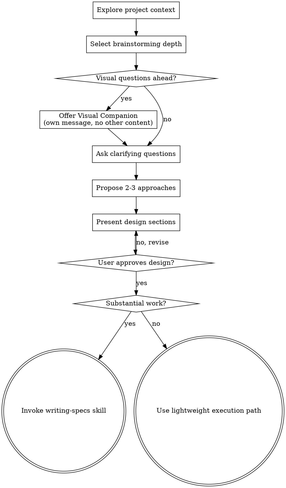

# Brainstorming Ideas Into Designs

Help turn ideas into fully formed designs and specs through natural collaborative dialogue.

Start by understanding the current project context, then ask questions one at a time to refine the idea. Once you understand what you're building, present the design and get user approval.

<HARD-GATE>
When this skill applies, do NOT invoke any implementation skill, write any code, scaffold any project, or take any implementation action until you have presented a design and the user has approved it.
</HARD-GATE>

## When To Use

Use this skill when the work needs product or design discovery before implementation:

- New features, workflows, pages, systems, or substantial components.
- Ambiguous behavior changes where requirements, success criteria, or user intent are not clear.
- Requests to explore options, compare approaches, design, plan, spec, or brainstorm.
- Multi-step work where implementation choices affect architecture, data flow, user experience, or future maintenance.

## When Not To Use

Do not invoke this skill just because code will change. Skip it for:

- Narrow user-directed edits with clear acceptance criteria.
- Small copy, style, spacing, color, or CSS fixes.
- Mechanical refactors, dependency bumps, generated code updates, or formatting.
- Implementing an already-approved spec or plan.
- Debugging a concrete failure where the question is root cause, not product direction.

For these cases, use normal engineering judgment and the relevant domain skill if one applies.

## Checklist

For substantial brainstorming work, create a task for each of these items and complete them in order. For lightweight discovery, keep the same sequence but collapse obvious steps into concise discussion.

1. **Explore project context** — check files, docs, recent commits (dispatch exploration subagents for anything beyond a couple of files; see "Dispatching Exploration Subagents" below). Under-exploring is the common failure mode, not over-exploring: explore before asking the first clarifying question, and keep dispatching as answers surface new unknowns
2. **Select brainstorming depth** — infer Technical Agent-Led, UX/Product Collaborative, or Lightweight; confirm only if ambiguous
3. **Offer visual companion** (if topic will involve visual questions) — this is its own message, not combined with a clarifying question. See the Visual Companion section below.
4. **Ask clarifying questions** — one at a time, tuned to the selected depth
5. **Propose 2-3 approaches** — with trade-offs and your recommendation
6. **Present design** — in sections scaled to their complexity, get user approval after each section
7. **Transition to writing-specs** — for substantial work, invoke `superpowers:writing-specs`
8. **Transition to lightweight execution** — for narrow approved work, use the lightweight path in `superpowers:subagent-driven-development`

## Process Flow

**For substantial work, the terminal state is invoking `writing-specs`.** Do NOT invoke frontend-design, mcp-builder, writing-plans, or any implementation skill while the brainstorming gate is active. The next skill after substantial brainstorming is `writing-specs`.

For narrow, approved work that does not need a saved spec or implementation plan, exit this skill after user approval and use the lightweight execution path in `superpowers:subagent-driven-development`.

## The Process

**Understanding the idea:**

- Check out the current project state first (files, docs, recent commits)
- Infer brainstorming depth from the request, and confirm only if ambiguous:
  - **Technical Agent-Led:** the user is low-opinionated or asks for a technical feature; do heavier repo/domain exploration, propose a concrete design, and ask the user only about high-impact tradeoffs.
  - **UX/Product Collaborative:** the work changes human-facing pages, workflows, or IA; ask deeper questions about pages involved, states, layout/template reuse, content, and interaction expectations, then propose options.
  - **Lightweight:** the request is narrow and low-risk; ask only the minimum needed to lock acceptance criteria.
- Before asking detailed questions, assess scope: if the request describes multiple independent subsystems (e.g., "build a platform with chat, file storage, billing, and analytics"), flag this immediately. Don't spend questions refining details of a project that needs to be decomposed first.
- If the project is too large for a single spec, help the user decompose into sub-projects: what are the independent pieces, how do they relate, what order should they be built? Then brainstorm the first sub-project through the normal design flow. Each sub-project gets its own spec → plan → implementation cycle.
- For appropriately-scoped projects, ask questions one at a time to refine the idea
- Prefer multiple choice questions when possible, but open-ended is fine too
- Only one question per message - if a topic needs more exploration, break it into multiple questions
- Exploration continues through the Q&A: when an answer names a page, flow, or subsystem you haven't verified, dispatch another exploration subagent with a more specific prompt instead of relying on assumptions about it
- Focus on understanding: purpose, constraints, success criteria

**Exploring approaches:**

- Propose 2-3 different approaches with trade-offs
- Present options conversationally with your recommendation and reasoning
- Lead with your recommended option and explain why

**Presenting the design:**

- Once you believe you understand what you're building, present the design
- Scale each section to its complexity: a few sentences if straightforward, up to 200-300 words if nuanced
- Ask after each section whether it looks right so far
- Cover: architecture, components, data flow, error handling, testing
- Be ready to go back and clarify if something doesn't make sense

**Design for isolation and clarity:**

- Break the system into smaller units that each have one clear purpose, communicate through well-defined interfaces, and can be understood and tested independently
- For each unit, you should be able to answer: what does it do, how do you use it, and what does it depend on?
- Can someone understand what a unit does without reading its internals? Can you change the internals without breaking consumers? If not, the boundaries need work.
- Smaller, well-bounded units are also easier for you to work with - you reason better about code you can hold in context at once, and your edits are more reliable when files are focused. When a file grows large, that's often a signal that it's doing too much.

**Working in existing codebases:**

- Explore the current structure before proposing changes. Follow existing patterns.
- Where existing code has problems that affect the work (e.g., a file that's grown too large, unclear boundaries, tangled responsibilities), include targeted improvements as part of the design - the way a good developer improves code they're working in.
- Don't propose unrelated refactoring. Stay focused on what serves the current goal.

## Dispatching Exploration Subagents

Your context is for design judgment, not for absorbing raw source code. When the exploration step requires more than a couple of files — reading several docs, surveying every module for a pattern, finding all callers of a function, mapping cross-cutting concerns, building an inventory of existing components — **dispatch a dedicated exploration subagent** instead of doing the reads in your own context. The subagent's context absorbs the file-reading noise; you receive only the distilled answer.

Failing to do this is the most common cause of context rot in planning sessions. A planner that reads 30 files inline before designing anything starts the design with a degraded context window and worse judgment than one that delegated the reads.

When in doubt, dispatch. The skip cases below are narrow exceptions, not an invitation to explore manually — an exploration subagent is cheap relative to a design built on unverified assumptions about the codebase. If you reach the approach-proposal step still guessing how the existing system works, exploration was skipped. Exploration is also not a one-shot first step: dispatch again whenever clarifying answers or design discussion surface code, flows, or constraints you haven't mapped.

**Dispatch an exploration subagent when:**

- You need to enumerate matches across many files (find all `.parse()` calls, all controllers without tenant scope, all components using a deprecated hook, every place a config value is referenced).
- You need to read and synthesize multiple docs (architecture/, ADRs, related specs, prior implementation plans).
- You need to map dependencies, call graphs, or cross-cutting concerns.
- You're building an inventory of existing patterns to follow ("how do other services in this codebase handle X").
- The work is *discover, then summarize* rather than *design or decide*.

**Skip the dispatch when:**

- The exploration is one or two files you already know the path of.
- You already have the answer from earlier in the session.
- The dispatch round-trip is more expensive than just reading the file (a single 50-line file lookup is faster inline).

**How to prompt the exploration subagent:**

- State precisely **what** to find or enumerate.
- State **where** to look (specific directories, file globs, doc folders).
- State **what format** to return: `file:line` list, signature list, brief structured summary, etc.
- Ask for **raw findings plus a short conclusion**, not interpretation — interpretation is your job. Example: "List all controllers under `apps/api/src/modules/**` that import `@nestjs/passport`. Return `file:line` for each import and a one-line summary at the end of how many files match."
- For sweep-style discovery the planner will paste into a plan, also ask for the exact `rg` / `grep` invocation the subagent used so the plan can include it as a re-runnable discovery command.

**Effort level for exploration subagents:**

- **Low effort:** simple Linear backlog scans, exact-match file lists, command/help lookups, or "return the top 10 likely related items" tasks where missing one obscure match is acceptable.
- **Medium effort (default for code/docs exploration):** codebase pattern surveys, caller inventories, route/component ownership maps, cross-doc synthesis, and sweep target enumeration.
- **High effort:** rare, only when the exploration requires judgment across ambiguous architecture/security/data boundaries. Prefer narrowing the task before escalating.

This applies to brainstorming **and** to planning. The writing-plans skill references this section for planning-time exploration; treat it as canonical guidance for both phases.

## After the Design

**Substantial work:**

- Invoke `superpowers:writing-specs` to save a compact spec, run mandatory spec review, handle Linear/worktree metadata, and get approval before planning.
- Do NOT invoke `writing-plans` directly from brainstorming for substantial work.

**Lightweight work:**

- Keep the approved design inline.
- Hand off to the lightweight execution path in `superpowers:subagent-driven-development`.
- The lightweight path still requires clear acceptance criteria, TDD where meaningful, spec compliance review, code quality review, a verified commit, and clean status.

## Key Principles

- **One question at a time** - Don't overwhelm with multiple questions
- **Multiple choice preferred** - Easier to answer than open-ended when possible
- **YAGNI ruthlessly** - Remove unnecessary features from all designs
- **Explore alternatives** - Always propose 2-3 approaches before settling
- **Incremental validation** - Present design, get approval before moving on
- **Be flexible** - Go back and clarify when something doesn't make sense

## Visual Companion

A browser-based companion for showing mockups, diagrams, and visual options during brainstorming. Available as a tool — not a mode. Accepting the companion means it's available for questions that benefit from visual treatment; it does NOT mean every question goes through the browser.

**Offering the companion:** When you anticipate that upcoming questions will involve visual content (mockups, layouts, diagrams), offer it once for consent:
> "Some of what we're working on might be easier to explain if I can show it to you in a web browser. I can put together mockups, diagrams, comparisons, and other visuals as we go. This feature is still new and can be token-intensive. Want to try it? (Requires opening a local URL)"

**This offer MUST be its own message.** Do not combine it with clarifying questions, context summaries, or any other content. The message should contain ONLY the offer above and nothing else. Wait for the user's response before continuing. If they decline, proceed with text-only brainstorming.

**Per-question decision:** Even after the user accepts, decide FOR EACH QUESTION whether to use the browser or the terminal. The test: **would the user understand this better by seeing it than reading it?**

- **Use the browser** for content that IS visual — mockups, wireframes, layout comparisons, architecture diagrams, side-by-side visual designs
- **Use the terminal** for content that is text — requirements questions, conceptual choices, tradeoff lists, A/B/C/D text options, scope decisions

A question about a UI topic is not automatically a visual question. "What does personality mean in this context?" is a conceptual question — use the terminal. "Which wizard layout works better?" is a visual question — use the browser.

If they agree to the companion, read the detailed guide before proceeding:
`skills/brainstorming/visual-companion.md`
