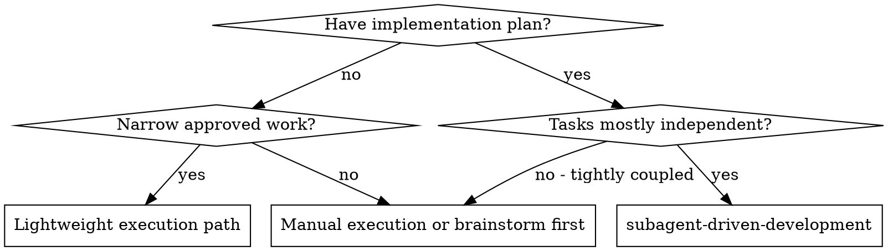
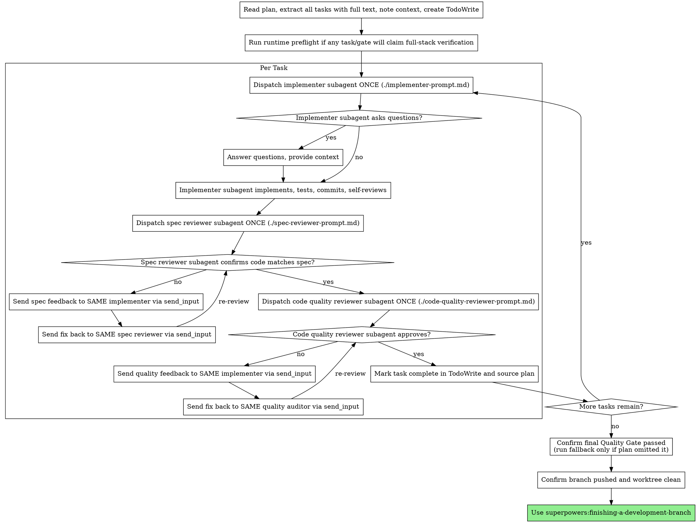
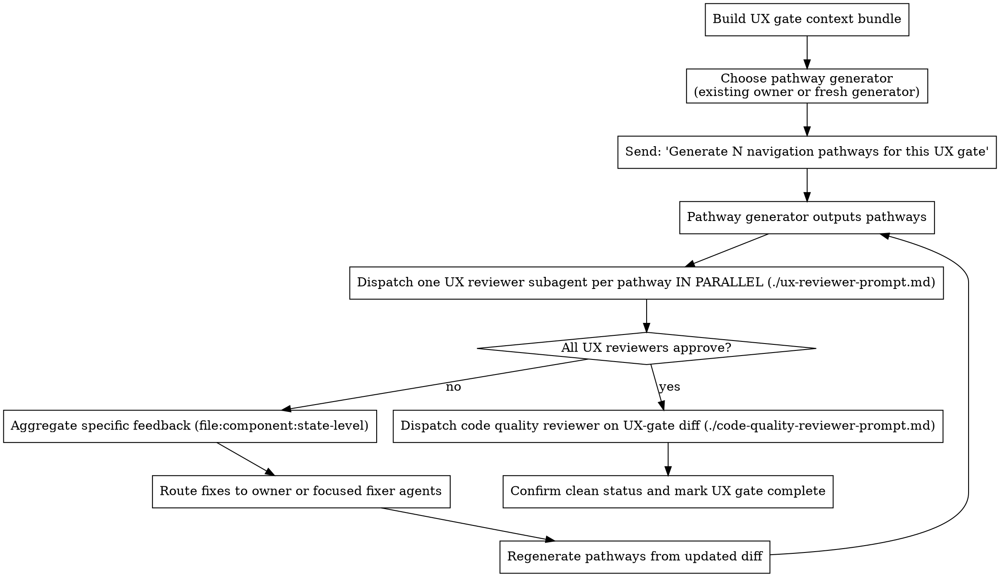

# Subagent-Driven Development

Execute approved implementation plans by dispatching exactly three task agents per implementation task: one implementer, one spec reviewer, and one code quality auditor. Keep all three threads open until that task is approved. Review-only gate tasks, such as UX Gates and Quality Gates, use their specialized flows instead.

For narrow work without a saved spec/plan, use the lightweight execution path below. Lightweight does not mean unreviewed: it still requires acceptance criteria, TDD where meaningful, spec compliance review, code quality review, a verified commit, clean status, and push before handoff.

**Why subagents:** You delegate tasks to specialized agents with isolated context. By precisely crafting their instructions and context, you ensure they stay focused and succeed at their task. They should never inherit your session's context or history — you construct exactly what they need. This also preserves your own context for coordination work.

**Implementers do not read the plan file.** They receive only the task text and references *you paste* into their prompt. When extracting tasks up front, also extract each task's `**References:**` block (if the planner provided one) and any plan-header material that the task depends on — design asset paths with "what to extract" notes, spec section pointers, reference docs, sibling-implementation pointers. Forward those into the implementer prompt's `## References` slot. If a plan lists design assets only at the top under `## Source Material` and the task body doesn't mention them, the planner failed step 5 of writing-plans § Self-Review — but you still need to forward the references; do not silently drop them.

**Core principle:** One persistent implementer thread + one persistent spec reviewer thread + one persistent quality auditor thread per task = high quality, fast iteration without context reload.

The implementer owns the code until both reviewers approve it. The spec reviewer owns spec compliance for the task. The quality auditor owns quality review for the task. If either reviewer requests changes, send the feedback to the same implementer thread with `send_input`; after the implementer fixes it, send the updated commit/context back to the same reviewer thread with `send_input`. If your platform calls this resume/follow-up instead of `send_input`, use that. Do not spawn replacement agents for review loops.

## When to Use



**Why this workflow:**
- Fresh three-agent team per task (no context pollution between tasks)
- Two-stage review after each task: spec compliance first, then code quality
- Faster iteration (no human-in-loop between tasks)

## The Process



## Runtime Preflight For Full-Stack Claims

Before dispatching agents that may claim E2E, browser, public-link, API+DB, UX, or full-stack verification, run the repo-approved startup checks. Discover commands from local docs/scripts; do not hardcode a global recipe.

Minimum evidence:
- Database is migrated and queryable, not merely port-reachable.
- Backend boots against that database and a health/API request succeeds.
- Frontend boots with its configured API URL and serves at least one route.

Record the exact commands, result, and any temporary env overrides. If preflight fails, continue only with clearly scoped unit/mock/static verification, or fix the environment if that is in scope. Do not let implementers, UX reviewers, spec reviewers, quality reviewers, or final reports call live app behavior "verified" without this evidence.

## Lightweight Execution Path

Use this path only for narrow, low-risk work with approved inline requirements. If the task expands beyond one coherent change, stop and move to `writing-specs` + `writing-plans`.

1. Write a short task brief in the conversation: goal, acceptance criteria, files likely touched, verification command, and out-of-scope boundaries.
2. Use TDD when the behavior is observable or risky; skip TDD only for tiny copy/style/docs/config edits where a test would add no useful signal.
3. Implement in the current branch/worktree only if it is appropriate for the work. For non-trivial work, use `superpowers:using-git-worktrees` first.
4. Run the smallest meaningful verification.
5. Commit the verified change. If Linear is attached, include the ticket ID in the commit message.
6. Run spec compliance review against the task brief.
7. Run code quality review after spec compliance passes.
8. Fix reviewer findings, re-run verification, and amend or add follow-up commits.
9. Confirm `git status --short` is clean.
10. Push the branch before handoff unless the user explicitly asked to keep it local.

Do not use this path to bypass a spec or implementation plan for multi-layer features, UX redesigns, security/data changes, migrations, or cross-cutting refactors.

## Thread Ownership

For each implementation task, keep exactly three task threads open from initial dispatch through final approval: the implementer, the spec reviewer, and the quality auditor. Gate tasks are review-only exceptions and use their own flows.

Use this pattern:

1. Spawn the implementer for Task N.
2. Wait for the implementer to commit and report status.
3. Spawn the spec reviewer for Task N and keep that reviewer thread open.
4. If the spec reviewer requests changes, send the findings to the same implementer with `send_input`, wait for its fix commit, then send the updated context back to the same spec reviewer with `send_input`.
5. After spec approval, spawn the code quality auditor for Task N and keep that auditor thread open.
6. If the quality auditor requests changes, send the findings to the same implementer with `send_input`, wait for its fix commit, then send the updated context back to the same quality auditor with `send_input`.
7. Repeat the loop among the same three task agents until both reviewers approve.
8. Close all three task agents only after both reviewers approve and the task is marked complete.

Do not create new agents for review feedback. The original task team has the task context, edited files, tradeoffs, test history, and prior review findings loaded. Replacing any of them during the loop wastes context and increases the chance of inconsistent fixes.

For the next task, start a fresh three-agent team unless the task explicitly continues the same ownership scope.

## Context Exhaustion

"Context problem" means a task agent's context window is too full or degraded to continue reliably. It does not mean the agent lacks a piece of task information.

If an agent reports `NEEDS_CONTEXT`, treat that as missing task information: send the requested information to the same thread with `send_input`.

Use `CONTEXT_EXHAUSTED` only for context-window capacity or degradation. Do not replace an agent just because it asked for more information.

Replace an agent only when its context is exhausted or it is otherwise unable to continue. When replacing one member of the three-agent task team:

1. Keep the other task agents open.
2. Spawn a replacement for only the exhausted role.
3. Give the replacement a handoff prompt with the task objective, current commits, files touched, review status, unresolved findings, verification already run, and what the prior agent owned.
4. Tell the replacement that work already exists and it must inspect current state before acting.
5. Continue the same task loop with the replacement in that role.

## Plan Progress Updates

When a task completes all required implementation, verification, spec review, and code quality review, update both:

1. TodoWrite task status
2. The source implementation plan file on disk

For the plan file, mark only the completed top-level task. Do not check off individual sub-steps unless the plan already requires that level of tracking.

Use the first format that fits the existing plan:

- If the task is a checkbox heading, change `- [ ] Task N` to `- [x] Task N`.
- If the task has a status line, change it to `**Status:** Completed`.
- Otherwise, add `**Status:** Completed` directly under the task heading.

Do this before starting the next task so a fresh session can identify the next unfinished task from the plan alone.

## Git Hygiene

Each completed implementation task must leave a verified commit and a clean worktree.

- Commit after each task's implementation, verification, spec review, and code quality review are complete.
- Include the Linear ticket ID in commit messages when a ticket is attached. The first implementation commit on a ticket branch must start with or include the ticket ID.
- Run `git status --short` before marking a task or gate complete. If anything is dirty, either commit it, explicitly revert only changes from the current task, or document why the task cannot be completed yet.
- Push at milestone Quality Gates, after the final Quality Gate, and before any handoff or PR creation.
- Do not report a task, gate, branch, or worktree as complete while intended changes are uncommitted.

## Model Selection

Use GPT-5.5 Medium for implementers and spec compliance reviewers by default. Use GPT-5.5 Medium for planning, coordination, debugging, code quality review, and UX review.

Quality Gate reviewers are the exception: spawn them with `reasoning_effort: xhigh`. If a gate reviewer explicitly decomposes a large review, its helper reviewers should use high effort and disjoint scopes. Fixer agents for Quality Gate findings should use high effort unless the fix is tiny and mechanical.

Do not escalate on the first failed review; review loops are expected. Escalate one effort level (Medium -> High) only after two full fix passes still receive essentially the same feedback on the same problem. Escalate again by one level only after the same pattern repeats.

GPT-5.5 High is a fallback's fallback for normal task work. Avoid GPT-5.5 X High except for explicit Quality Gate reviewer tasks or when the human explicitly requests it.

## Blocking Discipline

After dispatching or messaging subagents, block on the agent result whenever that result determines the next workflow action. Do not rely on asynchronous notifications to resume the workflow later.

- For one active agent, call `wait_agent` on that agent before returning to the user unless there is useful independent work to do immediately.
- For a parallel batch, call `wait_agent` on all agents whose results gate the next step, then process every completed result before continuing.
- If waiting times out, report exactly which agents are still running and what workflow step is blocked.
- Return to the user only when no agent result is needed to choose the next action, or when a timeout requires human direction.

## Handling Task Agent Status

Task agents may report these statuses. Handle each appropriately:

**DONE:** Proceed to spec compliance review.

**DONE_WITH_CONCERNS:** The implementer completed the work but flagged doubts. Read the concerns before proceeding. If the concerns are about correctness or scope, address them before review. If they're observations (e.g., "this file is getting large"), note them and proceed to review.

**NEEDS_CONTEXT:** The implementer needs information that wasn't provided. Provide the missing information to the same implementer with `send_input`.

**CONTEXT_EXHAUSTED:** The agent's context window is too full or degraded to continue reliably. Spawn a replacement for that role only, using a handoff prompt covering current task state, commits, files touched, verification, open review findings, and what the previous agent already tried or reviewed.

**BLOCKED:** The implementer cannot complete the task. Assess the blocker:
1. If it needs missing task information, provide that information to the same implementer with `send_input`
2. If its context window is too full, replace only that role using the Context Exhaustion handoff
3. If the task requires more reasoning, first redirect the same implementer with clearer guidance and up to two full fix passes on the same issue; only then replace or escalate one step
4. If the task is too large, break it into smaller pieces
5. If the plan itself is wrong, escalate to the human

**Never** ignore an escalation or force the same thread to retry without changes. If the implementer said it's stuck, something needs to change.

## UX Gates

Some plans contain a **UX Gate** task — a special review-only task marked `**Type:** UX Gate` that fires up a browser-driven UX reviewer loop after substantive frontend work. UX gates exist to catch failures that nothing else catches: pages that don't render, layouts that drift from the design system, ad-hoc styling that contradicts an established template, and broken interactive states. The planner decides *whether and where* to insert UX gates (see `superpowers:writing-plans` § "UX Gates"); your job is to execute them correctly.

If a UX gate task names a `**Required Skill:**`, include that instruction in the pathway-generation follow-up and in every UX reviewer prompt. For FSMCRM frontend UI, `fsmcrm-frontend-work` is required for UX gates and frontend-review agents.

### Recognizing A UX Gate Task

When extracting tasks up front, scan each task block for `**Type:** UX Gate`. UX gate tasks do **not** follow the regular implementer → spec reviewer → code quality reviewer flow. They follow the UX flow described below. Treat the gate as a single task in TodoWrite, but expect it to spawn more agents than a normal task.

### UX Gate Flow



**Step-by-step:**

1. **Build the UX gate context bundle.** Gather the gate task, routes/components under review, design intent, template references, task numbers, base/head commits, and summaries from all implementation tasks that contributed to the surface. Do not assume one prior implementer has the full context when multiple tasks built the surface.
2. **Choose a pathway generator.** If one still-open implementer clearly owns the whole surface, send the bundle to that thread. If ownership is spread across tasks or threads are closed, spawn a fresh medium-effort pathway generator with the bundle. The generator produces pathways only; it does not review or write code.
3. **Ask the pathway generator to generate pathways.** Send:
   > "We are now in a UX Gate for \[surface]. Review the actual diff you produced against the design intent, the template-pattern references, the UX acceptance criteria, and any Required Skill from the gate task. Then generate \[N=5–10] navigation pathways for UX review. Each pathway is a numbered, ordered list of concrete UI actions a fresh browser session should perform (URL to load, clicks, form fills, hover states, keyboard nav, viewport changes). Across the pathway set, cover mobile, tablet, desktop, and very large desktop viewports unless explicitly out of scope. Each pathway should target a distinct concern (empty state, populated state, create flow, edit flow, error state, responsive breakpoint, dark mode, keyboard nav, etc.). Report only the pathway list. Do not start any review yourself."
4. **Dispatch UX reviewers in parallel** — one ephemeral subagent per pathway, each in a *fresh session* using `./ux-reviewer-prompt.md`. Include the gate task's `**Required Skill:**` block in every reviewer prompt. Do not reuse UX reviewer threads across pathways or across loop iterations; freshness is the whole point.
5. **Aggregate UX feedback.** UX reviewers return specific, actionable findings (file:component:state-level — e.g., "`apps/web/components/.../customer-card.tsx`: empty-state copy is bottom-aligned in screenshot; design asset has it center-aligned"). Aggregate findings across reviewers, deduplicate, and group by component/concern.
6. **Route UX fixes to the right owner.** Send findings to the still-open implementer that owns the affected surface if one exists. If ownership is spread across tasks or threads are closed, spawn focused fixer agent(s) with disjoint write scopes. Require fixes to commit and report verification.
7. **Regenerate pathways after fixes.** Send the updated diff/context back to the pathway generator or spawn a fresh generator if its context is stale. Pathways must reflect the current implementation.
8. **Loop steps 4–7** until UX reviewers approve. UX reviewer iterations are expected; do not escalate on the first round.
9. **Dispatch the code quality reviewer** on the *entire UX-gate diff* (from the gate's first fix commit through the last). This catches over-engineering or sloppy fixes introduced during the UX loop.
10. **Confirm clean status and mark the UX gate task complete** in TodoWrite and the source plan.

### Pathway Discipline

- **Pathways are generated at runtime, not specified in the plan.** The plan provides UX acceptance criteria, design references, and optional coverage hints; the pathway generator uses the actual implementation diff because implementations drift from plans.
- **Each pathway runs in a fresh session.** Reusing browser sessions across pathways causes false positives (cookies, auth state, dirty form state) and false negatives (the reviewer "remembers" the page rendered correctly).
- **Pathways are regenerated each loop iteration.** The implementation has changed since the prior pathway list was generated, so new affordances or regressed states need fresh enumeration. The cost is one extra implementer turn per loop, which is cheaper than missing a regression.
- **Responsive coverage is required.** For frontend UI gates, the pathway set must cover mobile, tablet, desktop, and very large desktop viewports unless the gate task explicitly excludes one.
- **Cap pathways at ~10.** More than that suggests the gate's surface is too large and should have been split into multiple gates by the planner. If you find yourself with 20 pathways, escalate to the human — the gate is wrong, not the agents.

### Specificity Of UX Feedback

UX feedback that goes back to the implementer **must be specific**. "The page looks off" is unusable; "header height is 96px in the implementation but 64px in the design asset, and the action bar in `apps/web/components/.../customer-toolbar.tsx` overflows at tablet (768x1024)" is actionable. The UX reviewer prompt enforces this format; the orchestrator's job is to reject vague feedback before forwarding it. If a UX reviewer returns vague findings, send back to the *same UX reviewer thread* with `send_input`: "Be specific. For each finding, name the component file, the visual state, the breakpoint, and the exact deviation from the design intent. Re-screenshot if needed." Only forward to the implementer once feedback meets that bar.

### When UX Gate Diverges From The Plan

If, during pathway generation, the implementer reports that the implementation diverges from the plan's design intent in a way that is *intentional* and *correct* (e.g., "The plan referenced design-v1.png but the latest design in the repo is design-v2.png and we built to v2"), pause the gate, surface the divergence to the human, and resolve before continuing. UX reviewers will otherwise file findings against the wrong target.

## Quality Gates

Some plans contain **Quality Gate** tasks — review-only tasks marked `**Type:** Quality Gate`. Quality gates are a high-effort production-readiness check for a completed milestone slice or the full plan. They are deliberately higher-signal than per-task code-quality review: security, contracts, data integrity, ownership boundaries, major structural regressions, and risky untested behavior.

Every non-docs implementation plan should end with a final Quality Gate. Large plans may also include milestone gates after coherent feature slices. Do not invent extra milestone gates at runtime; the planner decides where they belong. If a code-bearing plan has no final Quality Gate, run one final gate anyway and report that the plan should be updated.

### Recognizing A Quality Gate Task

When extracting tasks up front, scan each task block for `**Type:** Quality Gate`. Quality Gate tasks do **not** follow the regular implementer → spec reviewer → code quality reviewer flow. They follow the gate flow below.

### Quality Gate Flow

1. **Identify the review surface.** Use the gate task's surface definition, task range, and base/head commits. For final fallback gates, use the full implementation diff.
2. **Spawn one gate reviewer** using `./gate-reviewer-prompt.md` with `reasoning_effort: xhigh`. Keep this reviewer thread open until the gate passes.
3. **Allow controlled decomposition.** If the gate reviewer says the surface is too large, it may dispatch up to 3 high-effort helper reviewers with disjoint scopes and synthesize their findings. Do not create overlapping helpers.
4. **Process findings.** Reject vague gate feedback before sending it to a fixer. Findings must include file:line, impact, and smallest clean fix shape.
5. **Route fixes to the right owner.**
   - If the finding belongs to one recently completed task and its implementer thread is still usable, send findings to that same implementer with `send_input`.
   - If the finding spans multiple completed tasks or the original implementer threads are closed, spawn high-effort fixer agent(s) with disjoint write scopes.
   - Do not hand one broad, tangled gate-fix task to a single agent when the findings have clean ownership boundaries.
6. **Re-review in the same gate thread.** After fixes are committed and verification is reported, send the updated commit range and fix summary back to the same xhigh gate reviewer with `send_input`.
7. **Loop until pass.** Quality Gate iterations are expected. Do not proceed to finishing-a-development-branch until the gate status is `Pass`.
8. **Mark the gate complete** in TodoWrite and the source plan.

### Quality Gate Discipline

- **High signal only.** Gate findings should block or seriously question merge readiness. Nits belong nowhere in this gate.
- **Security first.** Auth, tenant isolation, public-token flows, secrets, CSRF/session behavior, XSS, SSRF/uploads, webhooks/payments, and sensitive logging are always in scope.
- **Do not normalize debt.** Existing bad patterns are not precedent. Flag new or worsened use of a bad pattern and suggest a follow-up ticket for unrelated existing debt.
- **Code judo over polish.** Prefer fixes that delete complexity, move logic to the canonical owner, make contracts explicit, or decompose a large/tangled unit.
- **Separate from UX Gates.** UX Gates inspect rendered behavior. Quality Gates inspect production readiness, architecture, contracts, security, and tests.

## Prompt Templates

- `./implementer-prompt.md` - Dispatch implementer subagent
- `./spec-reviewer-prompt.md` - Dispatch spec compliance reviewer subagent
- `./code-quality-reviewer-prompt.md` - Dispatch code quality reviewer subagent
- `./ux-reviewer-prompt.md` - Dispatch UX reviewer subagent (one per pathway, parallel, fresh sessions only)
- `./gate-reviewer-prompt.md` - Dispatch xhigh Quality Gate reviewer for milestone or final production-readiness gate

## Example Workflow

```
You: I'm using Subagent-Driven Development to execute this plan.

[Read plan file once: docs/superpowers/plans/feature-plan.md]
[Extract all 5 tasks with full text and context]
[Create TodoWrite with all tasks]

Task 1: Hook installation script

[Get Task 1 text and context (already extracted)]
[Dispatch implementation subagent with full task text + context]

Implementer: "Before I begin - should the hook be installed at user or system level?"

You: "User level (~/.config/superpowers/hooks/)"

Implementer: "Got it. Implementing now..."
[Later] Implementer:
  - Implemented install-hook command
  - Added tests, 5/5 passing
  - Self-review: Found I missed --force flag, added it
  - Committed

[Dispatch spec compliance reviewer ONCE]
Spec reviewer: ✅ Spec compliant - all requirements met, nothing extra

[Get git SHAs, dispatch code quality reviewer]
Code reviewer: Strengths: Good test coverage, clean. Issues: None. Approved.

[Mark Task 1 complete]

Task 2: Recovery modes

[Get Task 2 text and context (already extracted)]
[Dispatch implementation subagent with full task text + context]

Implementer: [No questions, proceeds]
Implementer:
  - Added verify/repair modes
  - 8/8 tests passing
  - Self-review: All good
  - Committed

[Dispatch spec compliance reviewer ONCE]
Spec reviewer: ❌ Issues:
  - Missing: Progress reporting (spec says "report every 100 items")
  - Extra: Added --json flag (not requested)

[Send reviewer findings to same Task 2 implementer with send_input]
Implementer: Removed --json flag, added progress reporting

[Send updated commit/context to same spec reviewer with send_input]
Spec reviewer: ✅ Spec compliant now

[Dispatch code quality reviewer ONCE]
Code reviewer: Strengths: Solid. Issues (Important): Magic number (100)

[Send quality findings to same Task 2 implementer with send_input]
Implementer: Extracted PROGRESS_INTERVAL constant

[Send updated commit/context to same quality auditor with send_input]
Code reviewer: ✅ Approved

[Mark Task 2 complete]

...

Task N: Final Quality Gate
[Run Quality Gate with xhigh gate-reviewer]
Gate reviewer: Gate Status: Pass

[After all tasks]
[Confirm final Quality Gate already passed; no fallback needed]

Done!
```

## Advantages

**vs. Manual execution:**
- Subagents follow TDD naturally
- Fresh context per task (no confusion)
- Parallel-safe (subagents don't interfere)
- Subagent can ask questions (before AND during work)

**vs. Executing Plans:**
- Same session (no handoff)
- Continuous progress (no waiting)
- Review checkpoints automatic

**Efficiency gains:**
- No file reading overhead (controller provides full text)
- Controller curates exactly what context is needed
- Subagent gets complete information upfront
- Questions surfaced before work begins (not after)

**Quality gates:**
- Self-review catches issues before handoff
- Two-stage review: spec compliance, then code quality
- Review loops ensure fixes actually work
- Spec compliance prevents over/under-building
- Code quality ensures implementation is well-built
- Final Quality Gate catches cross-task security, contract, data integrity, ownership, and major maintainability risks before merge

**Cost:**
- More subagent invocations (implementer + 2 reviewers per task)
- Controller does more prep work (extracting all tasks upfront)
- Review loops add iterations
- But catches issues early (cheaper than debugging later)

## Red Flags

**Never:**
- Start implementation on main/master branch without explicit user consent
- Skip reviews (spec compliance OR code quality)
- Proceed with unfixed issues
- Dispatch multiple implementation subagents in parallel (conflicts)
- Spawn a new implementer to fix reviewer feedback while the original task implementer thread is open and not `CONTEXT_EXHAUSTED`
- Spawn a new spec reviewer or quality auditor for re-review while the original reviewer/auditor thread is open and not `CONTEXT_EXHAUSTED`
- Close any member of the task's three-agent team before both spec and quality reviews approve
- Make subagent read plan file (provide full text instead)
- Skip scene-setting context (subagent needs to understand where task fits)
- Ignore subagent questions (answer before letting them proceed)
- Accept "close enough" on spec compliance (spec reviewer found issues = not done)
- Skip review loops (reviewer found issues = implementer fixes = review again)
- Let implementer self-review replace actual review (both are needed)
- **Start code quality review before spec compliance is ✅** (wrong order)
- Move to next task while either review has open issues
- Skip the final Quality Gate for code-bearing plans. If the plan omitted it, run a fallback final gate and report the plan gap.
- Mark a task or gate complete with dirty uncommitted intended changes
- Skip required milestone/final branch pushes before handoff
- Treat a Quality Gate as a nit/style review instead of a production-readiness gate
- Spawn broad overlapping fixer agents for Quality Gate findings; split by clear ownership or reuse the responsible implementer thread

**If subagent asks questions:**
- Answer clearly and completely
- Provide additional context if needed
- Don't rush them into implementation

**If reviewer finds issues:**
- Send findings to the same implementer with `send_input`
- Same implementer fixes them
- Send the updated commit/context back to the same reviewer or auditor with `send_input`
- Repeat until approved
- Don't skip the re-review

**If subagent fails task:**
- First send specific recovery instructions to the same role thread
- Dispatch a replacement only after assessing that the agent is closed, context-exhausted, or cannot continue
- Replacement gets a handoff prompt and joins the same task loop; do not restart the task from scratch
- Don't try to fix manually (context pollution)

**UX gate-specific never:**
- Reuse a UX reviewer thread across pathways or across loop iterations (every pathway gets a fresh session — that's the point)
- Run UX reviewers sequentially when they could run in parallel (one per pathway, all fanned out at once)
- Forward vague UX feedback ("looks off", "feels wrong") to the implementer — bounce it back to the UX reviewer with `send_input` demanding component:state:breakpoint specificity
- Skip pathway regeneration after a fix commit (the implementation changed; old pathways may miss new regressions)
- Skip the final code quality review on the UX-gate diff — UX-loop fix passes are the most likely place for sloppy/over-engineered code to slip in
- Spawn a UX gate flow on tasks that aren't marked `**Type:** UX Gate` (the planner makes this decision; do not insert one yourself)

**Quality gate-specific never:**
- Run milestone gates after every task; milestone gates belong after large coherent feature slices only
- Proceed to branch finishing while a Quality Gate has unresolved Critical or Important findings
- Replace the xhigh gate reviewer thread during re-review unless it is context-exhausted or unable to continue
- Forward vague gate findings to fixers; require file:line, impact, and smallest clean fix shape

## Integration

**Required workflow skills:**
- **superpowers:using-git-worktrees** - REQUIRED: Set up isolated workspace before starting
- **superpowers:writing-plans** - Creates the plan this skill executes
- **superpowers:requesting-code-review** - Code review template for reviewer subagents
- **superpowers:finishing-a-development-branch** - Complete development after all tasks

**Subagents should use:**
- **superpowers:test-driven-development** - Subagents follow TDD for each task
