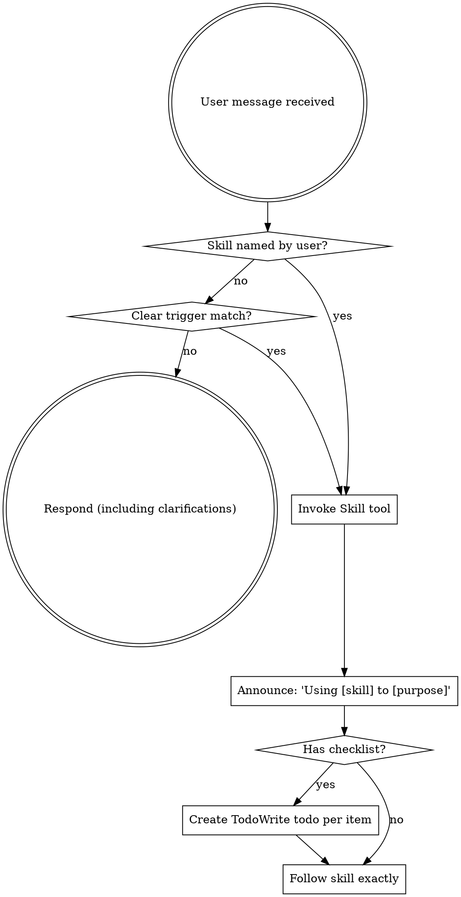

<SUBAGENT-STOP>
If you were dispatched as a subagent to execute a specific task, skip this skill.
</SUBAGENT-STOP>

<EXTREMELY-IMPORTANT>
Use skills when their trigger clearly matches the user's request or the user names the skill.

Do not invoke skills purely as a defensive ritual. If a task is small, direct, and outside a skill's stated trigger, proceed with normal engineering judgment.

If a skill applies to the task, use it. If you invoke a skill and it turns out to be the wrong fit, say so briefly and continue without forcing its workflow.
</EXTREMELY-IMPORTANT>

## Instruction Priority

Superpowers skills override default system prompt behavior, but **user instructions always take precedence**:

1. **User's explicit instructions** (CLAUDE.md, GEMINI.md, AGENTS.md, direct requests) — highest priority
2. **Superpowers skills** — override default system behavior where they conflict
3. **Default system prompt** — lowest priority

If CLAUDE.md, GEMINI.md, or AGENTS.md says "don't use TDD" and a skill says "always use TDD," follow the user's instructions. The user is in control.

## How to Access Skills

**In Claude Code:** Use the `Skill` tool. When you invoke a skill, its content is loaded and presented to you—follow it directly. Never use the Read tool on skill files.

**In Copilot CLI:** Use the `skill` tool. Skills are auto-discovered from installed plugins. The `skill` tool works the same as Claude Code's `Skill` tool.

**In Gemini CLI:** Skills activate via the `activate_skill` tool. Gemini loads skill metadata at session start and activates the full content on demand.

**In other environments:** Check your platform's documentation for how skills are loaded.

## Platform Adaptation

Skills use Claude Code tool names. Non-CC platforms: see `references/copilot-tools.md` (Copilot CLI), `references/codex-tools.md` (Codex) for tool equivalents. Gemini CLI users get the tool mapping loaded automatically via GEMINI.md.

# Using Skills

## The Rule

**Invoke named skills and clearly relevant skills before substantive work.** Match the user's request to the skill descriptions. Skills are tools for situations that need their workflow, not mandatory overhead for every adjacent keyword.

## Red Flags

These thoughts mean STOP if the request clearly matches a skill's trigger:

| Thought | Reality |
|---------|---------|
| "The user named this skill, but I can skip reading it" | Named skills must be read. |
| "I need more context first" | Skill check comes BEFORE clarifying questions. |
| "Let me explore the codebase first" | Skills tell you HOW to explore. Check first. |
| "The trigger matches, but I can check git/files quickly" | Skills may define how to inspect state. |
| "Let me gather information first" | Skills tell you HOW to gather information. |
| "This doesn't need a formal skill" | If the trigger clearly matches, use it. |
| "I remember this skill" | Skills evolve. Read current version. |
| "The skill is overkill" | Only skip when the task is genuinely outside the trigger. |
| "I'll just do this one thing first" | Check BEFORE doing anything. |
| "This feels productive" | Undisciplined action wastes time. Skills prevent this. |
| "I know what that means" | Knowing the concept ≠ using the skill. Invoke it. |

Non-red-flag: "This is a narrow typo, copy, or CSS tweak with an obvious owner and no broader behavior/design question." Handle it directly unless another skill specifically says it applies.

## Skill Priority

When multiple skills could apply, use this order:

1. **Process skills first** (brainstorming, writing-specs, debugging) - these determine WHAT should be built and why
2. **Planning/execution skills second** (writing-plans, subagent-driven-development) - these determine HOW to build and verify it
3. **Domain skills alongside the relevant phase** (frontend-design, mcp-builder, project-specific skills) - these guide specialized execution

"Let's design/build an ambiguous new feature" -> brainstorming first, then writing-specs for substantial work, then writing-plans, then implementation skills.
"Fix this reproducible/nontrivial bug" -> debugging first, then domain-specific skills.
"Change this button padding" -> the frontend/domain skill may apply, but brainstorming/debugging usually do not.

## Skill Types

**Rigid** (TDD, debugging): Follow exactly. Don't adapt away discipline.

**Flexible** (patterns): Adapt principles to context.

The skill itself tells you which.

## User Instructions

Instructions say WHAT, not HOW. "Add X" or "Fix Y" doesn't mean skip workflows.
